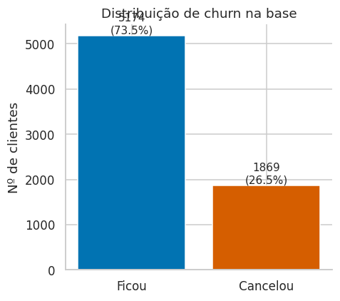
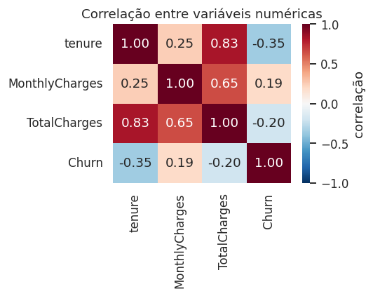
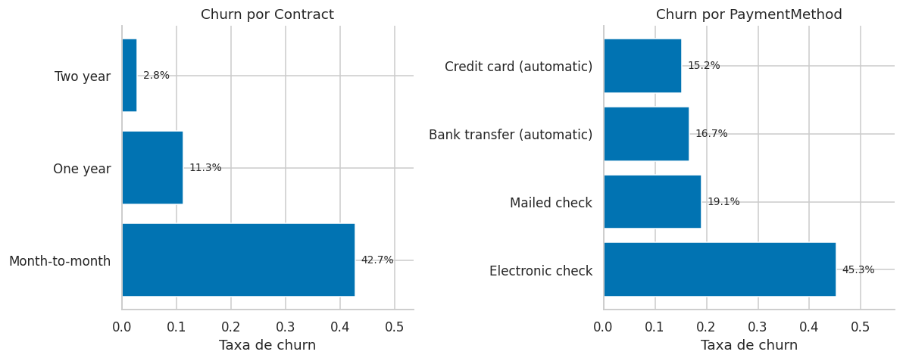
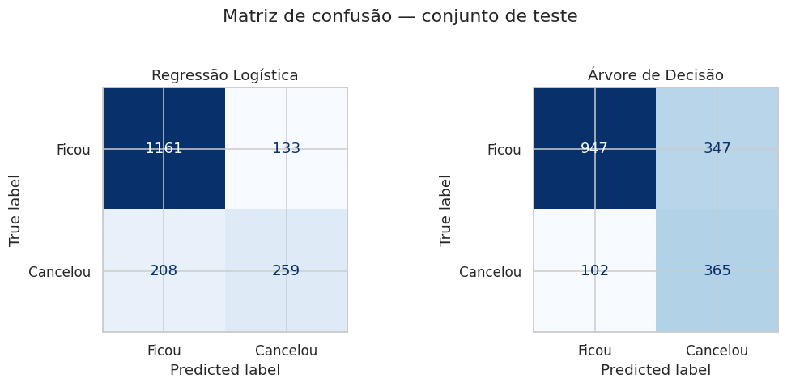
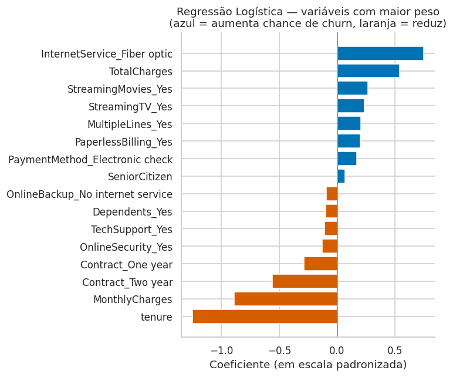
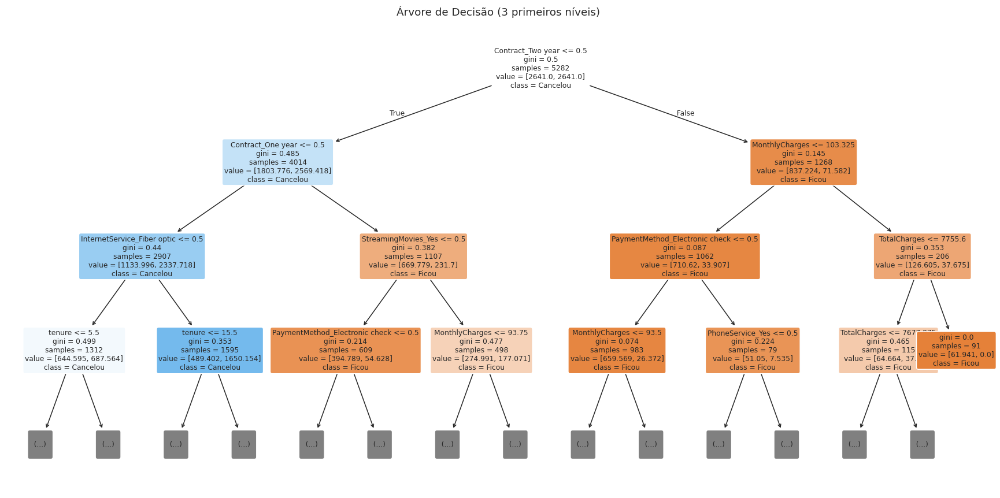

# Previsão de Churn de Clientes — Modelo Preditivo


Sistema de previsão de churn de clientes de telecom: treina e avalia modelos de classificação (Regressão Logística e Árvore de Decisão) e entrega um pipeline pronto para gerar previsões em lote via linha de comando — não é só um notebook de exploração, é uma ferramenta executável. Dataset: [Telco Customer Churn](https://raw.githubusercontent.com/IBM/telco-customer-churn-on-icp4d/master/data/Telco-Customer-Churn.csv) (IBM, 7.043 clientes, 21 variáveis).

Pipeline completo de ciência de dados: limpeza → análise exploratória → pré-processamento → treino de dois modelos → avaliação → interpretação → modelo empacotado para uso em produção.

## Notebook

[`notebook_modelo_preditivo.ipynb`](./notebook_modelo_preditivo.ipynb)

## O que o notebook cobre

- **Limpeza de dados:** tratamento de valores ausentes disfarçados (campo `TotalCharges` vindo como string vazia), conversão de tipos, remoção de identificador sem valor preditivo.
- **EDA:** estatísticas descritivas, distribuição do alvo, correlação entre variáveis numéricas, checagem de outliers, churn por variáveis categóricas.
- **Modelagem:** Regressão Logística e Árvore de Decisão (ambos escolhidos por serem simples e explicáveis).
- **Avaliação:** acurácia, precisão, recall, F1-score, ROC AUC e matriz de confusão — com discussão sobre por que acurácia sozinha engana numa base desbalanceada.
- **Interpretação:** coeficientes da regressão logística e visualização da árvore de decisão, ligando os resultados do modelo de volta à pergunta de negócio.

## Resultados

| Modelo | Acurácia | Precisão | Recall | F1-score | ROC AUC |
|---|---|---|---|---|---|
| Regressão Logística | 0,806 | 0,661 | 0,555 | 0,603 | 0,846 |
| Árvore de Decisão | 0,745 | 0,513 | 0,782 | 0,619 | 0,822 |

A Regressão Logística tem melhor precisão e ROC AUC; a Árvore de Decisão captura mais casos reais de churn (recall mais alto), à custa de mais falsos positivos. A escolha entre os dois depende do custo de negócio de cada tipo de erro.

**Principais fatores associados a churn:** contrato mês a mês, pagamento por cheque eletrônico, tempo de casa baixo, mensalidade alta e ausência de serviços adicionais (suporte técnico, segurança online).

## Galeria

| Distribuição do churn | Correlação entre variáveis |
|---|---|
|  |  |

| Churn por contrato e forma de pagamento | Matrizes de confusão |
|---|---|
|  |  |

| Coeficientes da Regressão Logística | Árvore de Decisão |
|---|---|
|  |  |

## Como usar

**Explorar a análise (notebook):**

```bash
python -m venv venv
source venv/bin/activate  # Windows: venv\Scripts\activate
pip install -r requirements.txt
jupyter notebook notebook_modelo_preditivo.ipynb
```

**Gerar previsões pra uma lista de clientes (linha de comando):**

O repositório já vem com o modelo treinado (`modelo_churn.joblib`), então dá pra prever sem precisar rodar o notebook:

```bash
pip install -r requirements.txt
python prever_churn.py --input exemplo_novos_clientes.csv --output previsoes.csv
```

Saída (`previsoes.csv`): um `customerID`, a `probabilidade_churn` (0 a 1) e a `previsao` (Ficou/Cancelou) por cliente, ordenado do maior pro menor risco — pronto pra alimentar uma lista de priorização do time de retenção.

Pra retreinar o modelo do zero com dados atualizados: `python treinar_modelo.py` (regera `modelo_churn.joblib` a partir de `data/`).

## Estrutura

```
customer-churn-prediction-model/
├── notebook_modelo_preditivo.ipynb   # análise completa: EDA, treino, avaliação, interpretação
├── treinar_modelo.py                 # treina e serializa o modelo de produção
├── prever_churn.py                   # CLI: gera previsões em lote a partir de um CSV
├── modelo_churn.joblib               # modelo treinado, pronto pra uso
├── exemplo_novos_clientes.csv        # exemplo de entrada pro prever_churn.py
├── data/                             # dataset
├── imagens/                          # gráficos gerados na análise
└── requirements.txt
```

## Stack

Python · pandas · numpy · scikit-learn · joblib · matplotlib · seaborn

## Licença

[MIT](./LICENSE)

## Projeto relacionado

[Teste de hipótese sobre os mesmos dados](https://github.com/Reinaldo-rNeto/Hipotese_Churn) — valida estatisticamente os padrões encontrados aqui na EDA.
